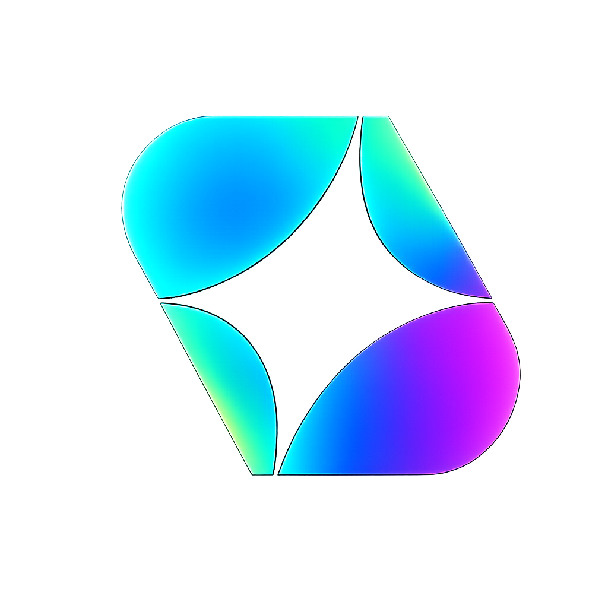

<div align="center">



<p style="margin: 0;">
  <strong style="font-size: 2em;">{{PROJECT_NAME}}</strong><br>
  <em>A mobile app exported from <a href="https://auroradev.me">Aurora</a> — ready to run locally, ship to TestFlight, or publish to the App Store.</em>
</p>

</div>

---

## Built with Aurora

[**Aurora**](https://auroradev.me) is an iOS app that lets you vibecode — build real apps with AI, directly on your iPhone. While you build, Aurora deploys a live preview you can open with **Run App** and optionally add to your Home Screen through Safari.

This repository is your project's source code. It started as the [Aurora-Primary/start](https://github.com/Aurora-Primary/start) template, customized with your app during export.

When you tap **Export** in Aurora, the app copies this project into a new repository under your GitHub account. You'll see:

> **Repository copied successfully**  
> *{repo} is now available in your GitHub account.*

You own this repo. You can keep building in Aurora separately — export creates a snapshot you can develop further on your Mac.

---

## What's in this repo

Your app is a **native iOS project** powered by React and Capacitor — not a pure SwiftUI app, but it builds and ships through Xcode like any other iPhone app.

| Layer | Technology |
| --- | --- |
| UI | React 19, TanStack Router, Tailwind CSS 4, shadcn/ui |
| App framework | [TanStack Start](https://tanstack.com/start) |
| Build | Vite 7 (outputs `.output/`) |
| Native shell | [Capacitor 8](https://capacitorjs.com) |
| iOS project | `ios/App/App.xcodeproj` (Swift, SPM) |

**How it fits together:** you edit your app in `src/`. A build step compiles it, Capacitor copies the result into the iOS project, and Xcode runs it on your iPhone or simulator.

---

## Prerequisites

Install these before you begin:

| Requirement | Notes |
| --- | --- |
| **macOS** | Required for Xcode and iOS builds |
| **Xcode 16+** | [Download from the Mac App Store](https://apps.apple.com/app/xcode/id497799835). Open it once to accept the license and install components. |
| **Node.js 22** | Matches `.node-version`. Install via [nodejs.org](https://nodejs.org) or `nvm install 22`. |
| **npm** | Ships with Node |
| **Apple Developer account** | Free for running on your own device; **paid ($99/yr)** for TestFlight and App Store distribution |

---

## Quick start

You'll run a few commands in **Terminal** — macOS's built-in command line app. Open it with **⌘Space**, type `Terminal`, and press Return. Copy each command below, paste it into Terminal, and press Return to run it.

### 1. Clone your repo

```bash
git clone https://github.com/YOUR_USERNAME/{{PROJECT_NAME}}.git
cd {{PROJECT_NAME}}
```

### 2. Install dependencies

```bash
npm install
```

### 3. Build and open in Xcode

```bash
npm run ios
```

This builds your app, syncs it into the iOS project, and opens `ios/App/App.xcodeproj` in Xcode. From there, press **⌘R** to run on a simulator or your iPhone (see [Test on your iPhone](#test-on-your-iphone) below).

> **First time?** If `npm run ios` fails, run `npm run build:ios` in Terminal first, then open `ios/App/App.xcodeproj` manually in Xcode.

---

## Test on your iPhone

### Simulator (no Apple Developer account needed)

1. Run `npm run ios` to open the project in Xcode.
2. At the top of Xcode, choose an **iPhone simulator** (e.g. iPhone 16).
3. Press **⌘R** (or click the Play button).

The simulator runs the same Capacitor-wrapped build as a real device.

### Physical device

1. Connect your iPhone via USB (or enable wireless debugging in Xcode).
2. In Xcode, select your **iPhone** as the run destination.
3. Select the **App** target → **Signing & Capabilities**.
4. Set **Team** to your Apple ID / developer team.
5. Change **Bundle Identifier** from `com.appstarter.app` to something unique (e.g. `com.yourname.{{PROJECT_NAME}}`).
6. Press **⌘R**. Approve the developer trust prompt on your iPhone if asked.

> Re-run `npm run build:ios` (or `npm run ios`) in Terminal whenever you change code in `src/` and want those changes on your iPhone.

---

## Publish your app

This template ships to the App Store as a native iOS app.

### 1. App icon & display name

In Xcode, open `ios/App/App/Assets.xcassets`:

- **AppIcon** — replace `AppIcon-light.png` and `AppIcon-dark.png` (1024×1024 each).
- Update **Display Name** in `ios/App/App/Info.plist` (`CFBundleDisplayName`) or in the App target's **General** tab.

Also update `capacitor.config.ts` (`appName`, `appId`) to match your branding.

### 2. Signing & capabilities

1. Select the **App** target in Xcode.
2. **Signing & Capabilities** → enable **Automatically manage signing**.
3. Choose your **Team** (paid Apple Developer account).
4. Set a unique **Bundle Identifier** (e.g. `com.yourname.{{PROJECT_NAME}}`).

### 3. Version & build number

In the App target **General** tab, set **Version** (`MARKETING_VERSION`) and **Build** (`CURRENT_PROJECT_VERSION`).

### 4. Build fresh assets

Run this in Terminal before every archive:

```bash
npm run build:ios
```

Always sync before archiving so the iOS app contains your latest build.

### 5. Archive → TestFlight → App Store

1. In Xcode, set the run destination to **Any iOS Device (arm64)**.
2. **Product → Archive**.
3. In the Organizer, click **Distribute App**.
4. Choose **App Store Connect** → upload to **TestFlight** for beta testing.
5. When ready, submit for **App Store** review in [App Store Connect](https://appstoreconnect.apple.com).

---

## After export from Aurora

| | Aurora (in-app) | This repo (GitHub) |
| --- | --- | --- |
| **What it is** | Where you vibecode with AI | Your exported source code |
| **Preview** | Run App → cloud deployment | Xcode (simulator or device) |
| **Ownership** | Aurora project | **You** — full GitHub repo |
| **Changes** | Continue building in Aurora anytime | Clone, edit, commit, ship independently |

Exporting does **not** disconnect your Aurora project. It creates a copy you can hand to Xcode, a collaborator, or the App Store review team.

---

## Project structure

```
{{PROJECT_NAME}}/
├── src/
│   ├── routes/           # Pages (file-based routing)
│   │   ├── __root.tsx    # App shell, meta tags, layout
│   │   └── index.tsx     # Home page (/)
│   ├── components/ui/    # shadcn/ui components
│   ├── lib/              # Utilities, server config, API functions
│   ├── server.ts         # Server entry (Nitro / TanStack Start)
│   └── styles.css        # Tailwind styles
├── ios/
│   └── App/
│       ├── App.xcodeproj # Open this in Xcode
│       └── App/          # Native project, icons, Info.plist
├── capacitor.config.ts   # Capacitor app ID, name, webDir
├── vite.config.ts        # Vite + TanStack Start + Nitro
├── railway.json          # Cloud deploy config
└── package.json          # Scripts and dependencies
```

**Key scripts**

| Command | What it does |
| --- | --- |
| `npm run build:ios` | Build app + `cap sync ios` |
| `npm run ios` | Build, sync, and open Xcode |

---

## Troubleshooting

<details>
<summary><strong>Code signing / "Signing requires a development team"</strong></summary>

<br>

Open `ios/App/App.xcodeproj` → select the **App** target → **Signing & Capabilities** → choose your **Team**. If none appears, add your Apple ID in **Xcode → Settings → Accounts**.

</details>

<details>
<summary><strong>Blank white screen in the iOS app</strong></summary>

<br>

The native shell loads the built web assets from `.output/public`. Run:

```bash
npm run build:ios
```

Then rebuild in Xcode (**⌘R**). The `ios/App/App/public` folder is regenerated by Capacitor and should not be edited by hand.

</details>

<details>
<summary><strong><code>npm install</code> or build failures</strong></summary>

<br>

- Confirm Node **22**: `node -v` should print `v22.x.x`.
- Delete `node_modules` and reinstall: `rm -rf node_modules && npm install`.
- For a clean iOS sync: `npm run build:ios`.

</details>

<details>
<summary><strong>Xcode can't resolve Capacitor (SPM) packages</strong></summary>

<br>

In Xcode: **File → Packages → Reset Package Caches**, then **Resolve Package Versions**. The Capacitor dependency is managed via Swift Package Manager in `ios/App/CapApp-SPM/`.

</details>

<details>
<summary><strong>Changes in <code>src/</code> don't appear on device</strong></summary>

<br>

The iOS app bundles a **built** copy of your code — it does not update automatically. After editing files in `src/`, run `npm run build:ios` in Terminal and rebuild in Xcode.

</details>

---

## Preview in the browser (optional)

In Aurora, **Run App** opens your live cloud deployment. If you want a similar local preview on your Mac — or to share a web version — you can run the app in a browser instead of Xcode.

### Dev server (while coding)

Open Terminal, `cd` into your project folder, and run:

```bash
npm run dev
```

Open the URL Terminal prints (usually `http://localhost:5173`). Edits in `src/` hot-reload in the browser.

### Production build preview

```bash
npm run build
npm run preview
```

Serves the built app — closer to what ships inside the iOS app.

### Add to Home Screen (Safari)

Your app includes PWA-friendly meta tags (`apple-mobile-web-app-capable`, etc. in `src/routes/__root.tsx`). When hosted at a public URL, users can tap **Share → Add to Home Screen** in Safari — the same flow Aurora uses for on-device preview.

### Web hosting

The server build can run on any Node host. This repo includes [Railway](https://railway.app) config:

```bash
npm run build
node .output/server/index.mjs
```

`railway.json` uses that start command automatically. Deploy to Railway (or similar) for a public URL.

| Command | What it does |
| --- | --- |
| `npm run dev` | Start local dev server |
| `npm run build` | Production build → `.output/` |
| `npm run preview` | Preview production build in browser |

---

## Support

Questions about Aurora itself? Visit **[auroradev.me/contact](https://auroradev.me/contact)**.

For code in this repo, open a GitHub Issue or continue building in the Aurora app.

---

<div align="center">

**[Aurora](https://auroradev.me)**

</div>
